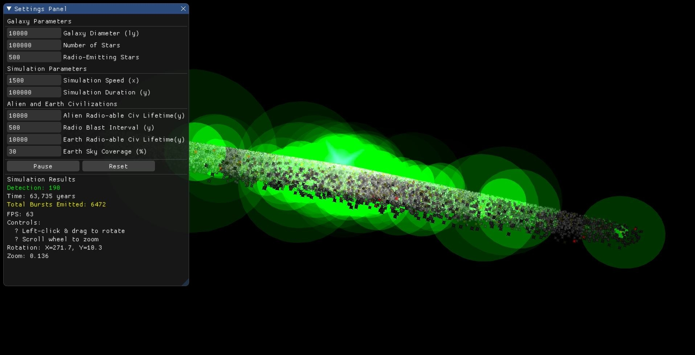
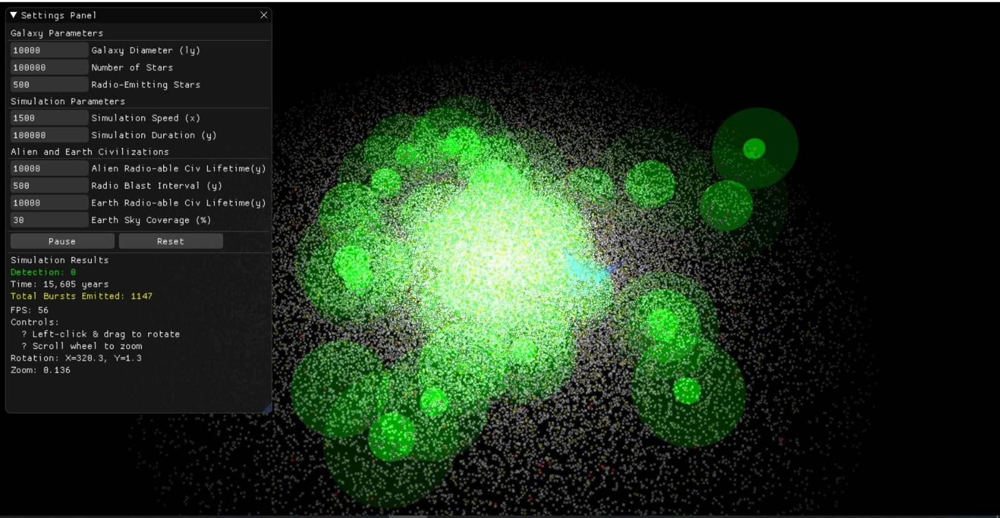
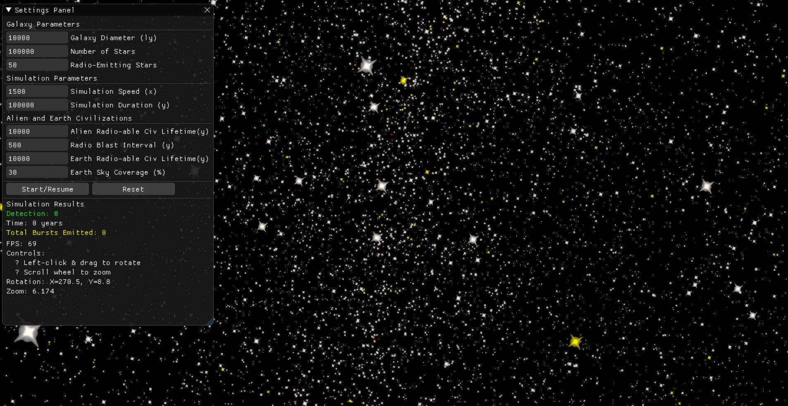
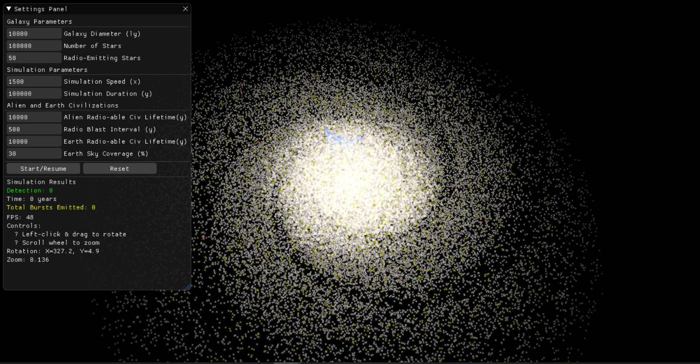

# Galactic Civilizations Radio Wave Detection Simulator

A 3D visualization and simulation of radio wave propagation across a galaxy, modeling the likelihood of detecting signals from distant civilizations.






## Description

This project simulates radio wave emissions from civilizations across a galaxy and visualizes their propagation in 3D space. It allows users to explore the parameters that affect the probability of detecting radio signals from alien civilizations, such as:
- Galaxy size and star distribution
- Number of radio-emitting stars
- Duration of civilizations' radio-emitting periods
- Earth's radio detection capabilities
- Sky coverage percentage

The simulation renders stars, Earth, and expanding radio waves using OpenGL, with an interactive UI built with ImGui.
Rendering performance is optimized to use instancing and buffers with shaders. Post processing shaders applied (blur, bloom, color correction).
On a macbook m1 it should be able to simulate on a 100k stars galaxy with comfortable fps.

## Features

- 3D galaxy model with realistic star distribution
- Dynamic radio wave propagation visualization
- Configurable simulation parameters
- Real-time detection statistics
- Interactive camera controls (rotation and zoom)

## Installation

### Requirements

- Python 3.10+
- OpenGL compatible graphics card

### Setup

1. Clone the repository
```
git clone (url)
cd 3d-galaxy-radio-waves
```

2. Install the required dependencies
```
pip install -r requirements.txt
```

3. Run the simulation
```
python main.py
```

**Note for Mac users:** 
Skip installing `PyOpenGL-accelerate` as it doesn't install properly on macOS

### Controls
- Left-click and drag to rotate the view
- Scroll wheel to zoom in/out
- Use the UI panel to adjust simulation parameters

## Profiling

To profile the performance of the simulation, you can use the following commands:
```
python -m cProfile -o profile_result.dat main.py
snakeviz profile_result.dat
```

## License

This project is licensed under the MIT License - see the [LICENSE](LICENSE) file for details.
